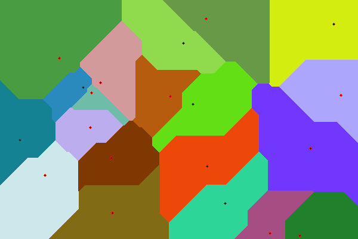

# voronoi

Generate a voronoi diagram from a set of random points.

To run:

1. 'cabal configure'
2. 'cabal build'
3. './dist/build/voronoi/voronoi [i|N]'

The command-line option specifies which norm to use; the l2 (Euclidian) norm is the default. N can be any (whole or fractional) number, or use "i" for l∞.

# Screenshots

Using Euclidian distance (l2 norm):

  

Using Manhattan distance (l1 norm):

  

Using l∞ norm:

  

Using l1.2 norm (uhh, pseudo-Manhattan?):

  
